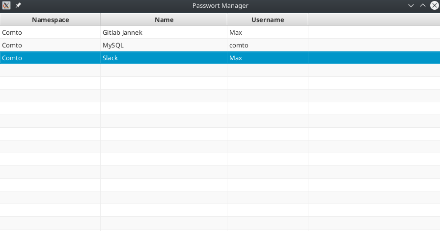
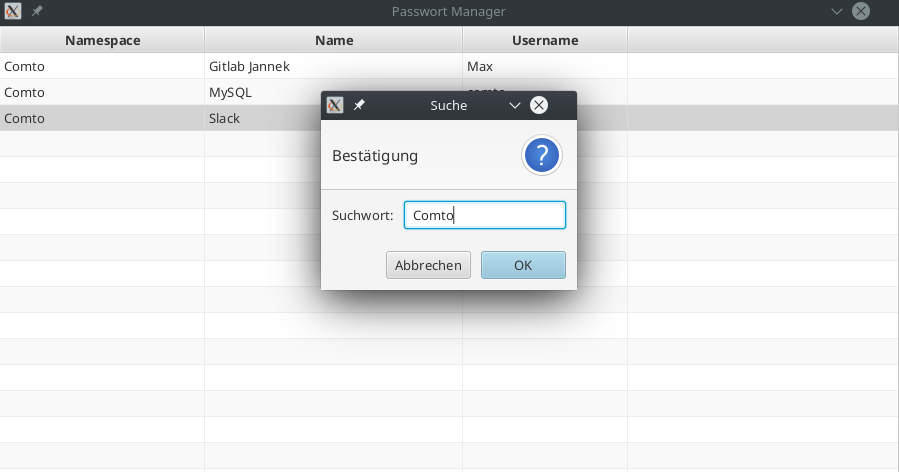

# Description

Simple alternative Bitwarden Interface.
If you have questions or suggestions, please feel free to open 
a issue or write a mail to dev@maax.gr 

##Supported features
* List all password entries
* Search for password entry with `Ctrl+F`
* Copy username with `Ctrl+B` on selected entry
* Copy password with `Ctrl+C` on selected entry

##Screenshots
| Description | Image | 
| ------------- | ------------- | 
| List of password entries  |  |
| Search for a password entry |  |

# Dependencies
* Arch Linux
* Java 11 or newer
* Bitwarden Cli

# Getting started for Linux
1. Download package file: `wget https://raw.githubusercontent.com/MaaxGr/BitwardenGUI/master/pkgs/arch/PKGBUILD`
2. Make package: `makepkg -si`
3. Login into bitwarden cli `bw login`
4. Go into root with `su`
5. Save bitwarden access token into settings.properties `echo "bitwarden.session=PUT_TOKEN_HERE" > /usr/share/java/bitwarden-gui/settings.properties`
